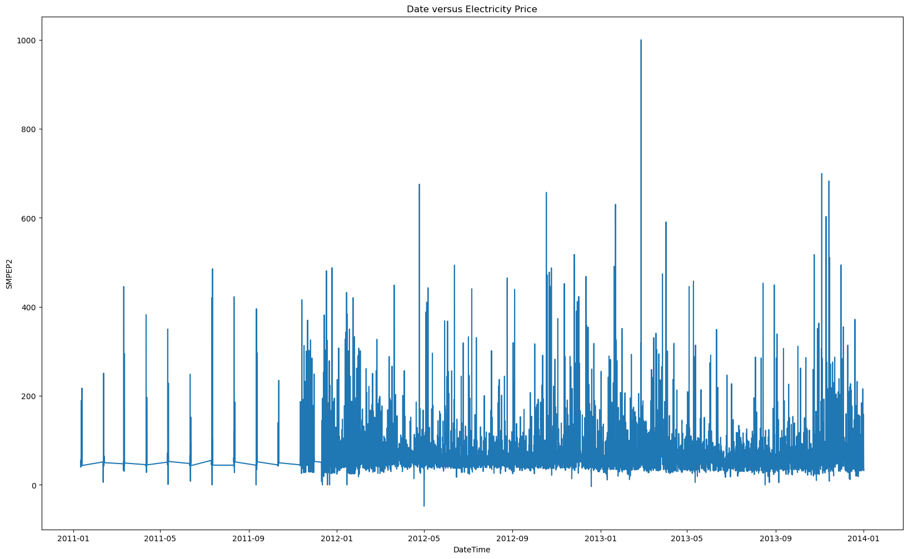
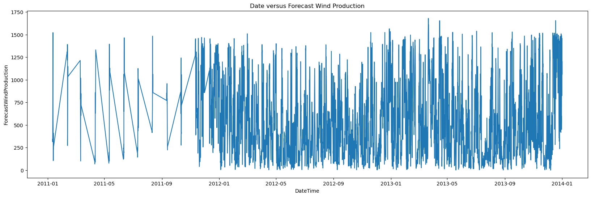
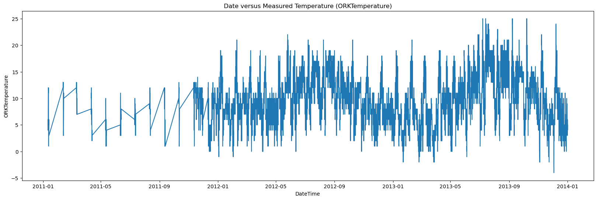
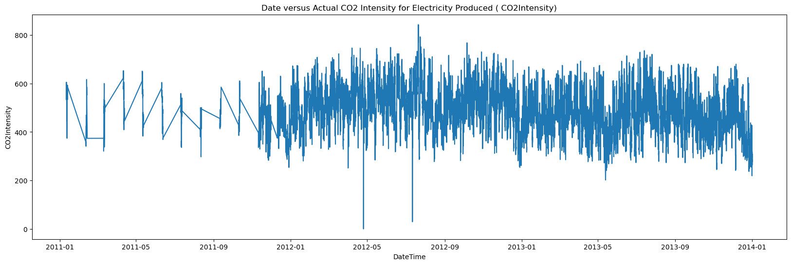
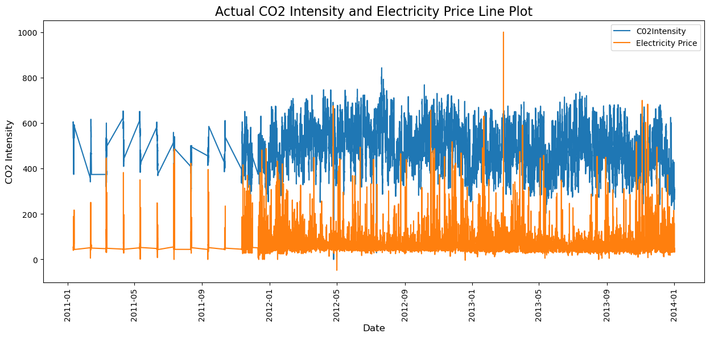
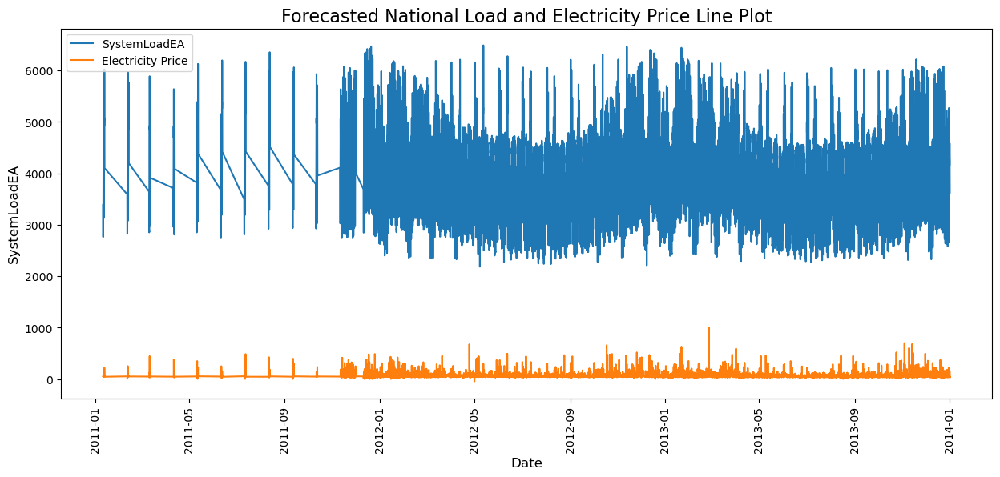

# Electricity Price Prediction Project
### Can we predict the price of electricity given just a few indicators?

Upmath extremely simplifies this task by using Markdown and LaTeX. It converts the Markdown syntax extended with LaTeX equations support into HTML code you can publish anywhere on the web.

[Custom foo description](#foo)


 links: [service main page](/ "link title");
 

1. [The Problem and strategy](#problem)
2. [Exploratory data analysis](#Exploratory-Data-Analysis)
3. Preprocessing the data(#Preprocessing-the-Data)
4. Machine learning models
5. Final conclusion
 
 
 
 
 
 # Problem
 ## Pricing Electricity: Challenge and Strategy
 
Predicting the price of electricity is a multifaceted problem that influenced by a myriad of physical and economic factors. 
The challenge I have been given is to forecast the price of electricity for a company, given a dataset including 16 
factors and the historical price of electricity for over 38,000 instances.

I am free to select any modeling algorithm to make the forecasts, but I need to justify the final model that I select to make predictions. 

In the exploration, I explored four supervised machine learning algorithms: linear regression, linear regression with VIF applied, support vector machines, and 
gradient boost regression. Support vector machines and gradient boost gave similarly precise models. I would recommend the gradient 
booster regression model over the support vector machines as it is not as demanding of computational resources.
 
 ## Glossary of terms used 
 
DateTime: Date and time of the record
Holiday: contains the name of the holiday if the day is a national holiday
HolidayFlag: contains 1 if it’s a bank holiday otherwise 0
DayOfWeek: contains values between 0-6 where 0 is Monday
WeekOfYear: week of the year
Day: Day of the date
Month: Month of the date
Year: Year of the date
PeriodOfDay: half-hour period of the day
ForcastWindProduction: forecasted wind production
SystemLoadEA forecasted national load
SMPEA: forecasted price
ORKTemperature: actual temperature measured
ORKWindspeed: actual windspeed measured
CO2Intensity: actual C02 intensity for the electricity produced
ActualWindProduction: actual wind energy production
SystemLoadEP2: actual national system load
SMPEP2: the actual price of the electricity consumed (labels or values to be predicted)
 
 # Exploratory Data Analysis
 
 ## Begin by downloading the anticipated dependencies

```python
import pandas as pd
import numpy as np
import seaborn as sns
import matplotlib.pyplot as plt
from sklearn.preprocessing import StandardScaler
from sklearn.preprocessing import OneHotEncoder
from sklearn.preprocessing import LabelEncoder
from sklearn.linear_model import LinearRegression
from sklearn.preprocessing import PolynomialFeatures
from sklearn.model_selection import train_test_split
from sklearn.pipeline import Pipeline
from statsmodels.stats.outliers_influence import variance_inflation_factor
```

```python
df = pd.read_csv("https://raw.githubusercontent.com/amankharwal/Website-data/master/electricity.csv", 
                 low_memory=False)
```

### Look at the first and last five rows of the data
```python
df.head()
df.tail()
```

```python
df.info()
```


<div>
<style scoped>
    .dataframe tbody tr th:only-of-type {
        vertical-align: middle;
    }

    .dataframe tbody tr th {
        vertical-align: top;
    }

    .dataframe thead th {
        text-align: right;
    }
</style>
<table border="1" class="dataframe">
  <thead>
    <tr style="text-align: right;">
      <th></th>
      <th>DateTime</th>
      <th>Holiday</th>
      <th>HolidayFlag</th>
      <th>DayOfWeek</th>
      <th>WeekOfYear</th>
      <th>Day</th>
      <th>Month</th>
      <th>Year</th>
      <th>PeriodOfDay</th>
      <th>ForecastWindProduction</th>
      <th>SystemLoadEA</th>
      <th>SMPEA</th>
      <th>ORKTemperature</th>
      <th>ORKWindspeed</th>
      <th>CO2Intensity</th>
      <th>ActualWindProduction</th>
      <th>SystemLoadEP2</th>
      <th>SMPEP2</th>
    </tr>
  </thead>
  <tbody>
    <tr>
      <th>38009</th>
      <td>31/12/2013 21:30</td>
      <td>New Year's Eve</td>
      <td>1</td>
      <td>1</td>
      <td>1</td>
      <td>31</td>
      <td>12</td>
      <td>2013</td>
      <td>43</td>
      <td>1179.14</td>
      <td>3932.22</td>
      <td>34.51</td>
      <td>6.00</td>
      <td>22.20</td>
      <td>285.31</td>
      <td>812.00</td>
      <td>3692.95</td>
      <td>42.45</td>
    </tr>
    <tr>
      <th>38010</th>
      <td>31/12/2013 22:00</td>
      <td>New Year's Eve</td>
      <td>1</td>
      <td>1</td>
      <td>1</td>
      <td>31</td>
      <td>12</td>
      <td>2013</td>
      <td>44</td>
      <td>1152.01</td>
      <td>3821.44</td>
      <td>33.83</td>
      <td>5.00</td>
      <td>24.10</td>
      <td>278.31</td>
      <td>852.00</td>
      <td>3571.00</td>
      <td>33.83</td>
    </tr>
    <tr>
      <th>38011</th>
      <td>31/12/2013 22:30</td>
      <td>New Year's Eve</td>
      <td>1</td>
      <td>1</td>
      <td>1</td>
      <td>31</td>
      <td>12</td>
      <td>2013</td>
      <td>45</td>
      <td>1123.67</td>
      <td>3724.21</td>
      <td>31.75</td>
      <td>4.00</td>
      <td>20.40</td>
      <td>280.91</td>
      <td>962.00</td>
      <td>3460.29</td>
      <td>31.75</td>
    </tr>
    <tr>
      <th>38012</th>
      <td>31/12/2013 23:00</td>
      <td>New Year's Eve</td>
      <td>1</td>
      <td>1</td>
      <td>1</td>
      <td>31</td>
      <td>12</td>
      <td>2013</td>
      <td>46</td>
      <td>1094.24</td>
      <td>3638.16</td>
      <td>33.83</td>
      <td>5.00</td>
      <td>14.80</td>
      <td>302.46</td>
      <td>950.00</td>
      <td>3563.99</td>
      <td>50.60</td>
    </tr>
    <tr>
      <th>38013</th>
      <td>31/12/2013 23:30</td>
      <td>New Year's Eve</td>
      <td>1</td>
      <td>1</td>
      <td>1</td>
      <td>31</td>
      <td>12</td>
      <td>2013</td>
      <td>47</td>
      <td>1064.00</td>
      <td>3624.25</td>
      <td>33.83</td>
      <td>5.00</td>
      <td>16.70</td>
      <td>308.01</td>
      <td>1020.00</td>
      <td>3517.08</td>
      <td>34.90</td>
    </tr>
  </tbody>
</table>
</div>


```python
df.info()
```

    <class 'pandas.core.frame.DataFrame'>
    RangeIndex: 38014 entries, 0 to 38013
    Data columns (total 18 columns):
     #   Column                  Non-Null Count  Dtype 
    ---  ------                  --------------  ----- 
     0   DateTime                38014 non-null  object
     1   Holiday                 38014 non-null  object
     2   HolidayFlag             38014 non-null  int64 
     3   DayOfWeek               38014 non-null  int64 
     4   WeekOfYear              38014 non-null  int64 
     5   Day                     38014 non-null  int64 
     6   Month                   38014 non-null  int64 
     7   Year                    38014 non-null  int64 
     8   PeriodOfDay             38014 non-null  int64 
     9   ForecastWindProduction  38014 non-null  object
     10  SystemLoadEA            38014 non-null  object
     11  SMPEA                   38014 non-null  object
     12  ORKTemperature          38014 non-null  object
     13  ORKWindspeed            38014 non-null  object
     14  CO2Intensity            38014 non-null  object
     15  ActualWindProduction    38014 non-null  object
     16  SystemLoadEP2           38014 non-null  object
     17  SMPEP2                  38014 non-null  object
    dtypes: int64(7), object(11)
    memory usage: 5.2+ MB


```python
df.shape
```


    (38014, 18)


## Glossary

DateTime: Date and time of the record  
Holiday: contains the name of the holiday if the day is a national holiday  
HolidayFlag: contains 1 if it’s a bank holiday otherwise 0  
DayOfWeek: contains values between 0-6 where 0 is Monday  
WeekOfYear: week of the year  
Day: Day of the date  
Month: Month of the date  
Year: Year of the date  
PeriodOfDay: half-hour period of the day  
ForcastWindProduction: forecasted wind production  
SystemLoadEA forecasted national load  
SMPEA: forecasted price  
ORKTemperature: actual temperature measured  
ORKWindspeed: actual windspeed measured  
CO2Intensity: actual C02 intensity for the electricity produced  
ActualWindProduction: actual wind energy production  
SystemLoadEP2: actual national system load  
SMPEP2: the actual price of the electricity consumed (labels or values to be predicted)

## Check for missing values in the data; there are no holes at this point


```python
df.isnull().sum()
```


    DateTime                  0
    Holiday                   0
    HolidayFlag               0
    DayOfWeek                 0
    WeekOfYear                0
    Day                       0
    Month                     0
    Year                      0
    PeriodOfDay               0
    ForecastWindProduction    0
    SystemLoadEA              0
    SMPEA                     0
    ORKTemperature            0
    ORKWindspeed              0
    CO2Intensity              0
    ActualWindProduction      0
    SystemLoadEP2             0
    SMPEP2                    0
    dtype: int64


## Look at descriptive stats of the numerical data


```python
df.describe()
```


<div>
<style scoped>
    .dataframe tbody tr th:only-of-type {
        vertical-align: middle;
    }

    .dataframe tbody tr th {
        vertical-align: top;
    }

    .dataframe thead th {
        text-align: right;
    }
</style>
<table border="1" class="dataframe">
  <thead>
    <tr style="text-align: right;">
      <th></th>
      <th>HolidayFlag</th>
      <th>DayOfWeek</th>
      <th>WeekOfYear</th>
      <th>Day</th>
      <th>Month</th>
      <th>Year</th>
      <th>PeriodOfDay</th>
    </tr>
  </thead>
  <tbody>
    <tr>
      <th>count</th>
      <td>38014.000000</td>
      <td>38014.000000</td>
      <td>38014.000000</td>
      <td>38014.000000</td>
      <td>38014.000000</td>
      <td>38014.000000</td>
      <td>38014.000000</td>
    </tr>
    <tr>
      <th>mean</th>
      <td>0.040406</td>
      <td>2.997317</td>
      <td>28.124586</td>
      <td>15.739412</td>
      <td>6.904246</td>
      <td>2012.383859</td>
      <td>23.501105</td>
    </tr>
    <tr>
      <th>std</th>
      <td>0.196912</td>
      <td>1.999959</td>
      <td>15.587575</td>
      <td>8.804247</td>
      <td>3.573696</td>
      <td>0.624956</td>
      <td>13.853108</td>
    </tr>
    <tr>
      <th>min</th>
      <td>0.000000</td>
      <td>0.000000</td>
      <td>1.000000</td>
      <td>1.000000</td>
      <td>1.000000</td>
      <td>2011.000000</td>
      <td>0.000000</td>
    </tr>
    <tr>
      <th>25%</th>
      <td>0.000000</td>
      <td>1.000000</td>
      <td>15.000000</td>
      <td>8.000000</td>
      <td>4.000000</td>
      <td>2012.000000</td>
      <td>12.000000</td>
    </tr>
    <tr>
      <th>50%</th>
      <td>0.000000</td>
      <td>3.000000</td>
      <td>29.000000</td>
      <td>16.000000</td>
      <td>7.000000</td>
      <td>2012.000000</td>
      <td>24.000000</td>
    </tr>
    <tr>
      <th>75%</th>
      <td>0.000000</td>
      <td>5.000000</td>
      <td>43.000000</td>
      <td>23.000000</td>
      <td>10.000000</td>
      <td>2013.000000</td>
      <td>35.750000</td>
    </tr>
    <tr>
      <th>max</th>
      <td>1.000000</td>
      <td>6.000000</td>
      <td>52.000000</td>
      <td>31.000000</td>
      <td>12.000000</td>
      <td>2013.000000</td>
      <td>47.000000</td>
    </tr>
  </tbody>
</table>
</div>


## Determine the data types of the data; several have datatype  of object but are actually numeric, categorical, or datetime. These need to be converted to float, category and datetime, respectively.


```python

```


```python
df.select_dtypes(include=['object']).dtypes
```


    DateTime                  object
    Holiday                   object
    ForecastWindProduction    object
    SystemLoadEA              object
    SMPEA                     object
    ORKTemperature            object
    ORKWindspeed              object
    CO2Intensity              object
    ActualWindProduction      object
    SystemLoadEP2             object
    SMPEP2                    object
    dtype: object


```python
df.select_dtypes(include=['object']).value_counts()
df['ORKWindspeed'].head()
```


    0     9.30
    1    11.10
    2    11.10
    3     9.30
    4    11.10
    Name: ORKWindspeed, dtype: object


```python
df["DateTime"]
```


    0        01/11/2011 00:00
    1        01/11/2011 00:30
    2        01/11/2011 01:00
    3        01/11/2011 01:30
    4        01/11/2011 02:00
                   ...       
    38009    31/12/2013 21:30
    38010    31/12/2013 22:00
    38011    31/12/2013 22:30
    38012    31/12/2013 23:00
    38013    31/12/2013 23:30
    Name: DateTime, Length: 38014, dtype: object


## Convert the datetime column to datetime datatype


```python
df['DateTime'] = pd.to_datetime(df['DateTime'])
df['DateTime'].head()
```


    0   2011-01-11 00:00:00
    1   2011-01-11 00:30:00
    2   2011-01-11 01:00:00
    3   2011-01-11 01:30:00
    4   2011-01-11 02:00:00
    Name: DateTime, dtype: datetime64[ns]


## Convert the mislabeled categorical columns to categorical


```python
df['Holiday'] = df['Holiday'].astype('category')
df['Holiday']
```


    0                  None
    1                  None
    2                  None
    3                  None
    4                  None
                  ...      
    38009    New Year's Eve
    38010    New Year's Eve
    38011    New Year's Eve
    38012    New Year's Eve
    38013    New Year's Eve
    Name: Holiday, Length: 38014, dtype: category
    Categories (15, object): ['August Bank Holiday', 'Christmas', 'Christmas Eve', 'Easter', ..., 'None', 'October Bank Holiday', 'St Patrick's Day', 'St Stephen's Day']


## Convert all of the objects that are numeric to float


```python
df[["SystemLoadEA", "SMPEA",'ORKTemperature','CO2Intensity','SMPEP2','SystemLoadEP2','ActualWindProduction',
   'ORKWindspeed','ForecastWindProduction']]= df[['SystemLoadEA',
           "SMPEA",'ORKTemperature','CO2Intensity',
         'SMPEP2','SystemLoadEP2','ActualWindProduction','ORKWindspeed',
            'ForecastWindProduction']].apply(pd.to_numeric, errors='coerce')
# confirm that all of the data types are correct
df.dtypes
```


    DateTime                  datetime64[ns]
    Holiday                         category
    HolidayFlag                        int64
    DayOfWeek                          int64
    WeekOfYear                         int64
    Day                                int64
    Month                              int64
    Year                               int64
    PeriodOfDay                        int64
    ForecastWindProduction           float64
    SystemLoadEA                     float64
    SMPEA                            float64
    ORKTemperature                   float64
    ORKWindspeed                     float64
    CO2Intensity                     float64
    ActualWindProduction             float64
    SystemLoadEP2                    float64
    SMPEP2                           float64
    dtype: object


## Data viz: look at some line plots to visualize the data and look for trends


```python
plt.figure(figsize=(20,12))
sns.lineplot(x='DateTime', y='SMPEP2', data = df)
plt.title("Date versus Electricity Price")
plt.show()
```


    

    


```python
plt.figure(figsize=(20,6))
sns.lineplot(x='DateTime', y='ForecastWindProduction',data=df)
plt.title("Date versus Forecast Wind Production")
plt.show()
```


    

    


```python
plt.figure(figsize=(20,6))
sns.lineplot(x='DateTime', y='SystemLoadEA',data=df)
plt.title("Date versus Forecasted National Load (SystemLoadEA)")
plt.show()
```


    

    


```python
plt.figure(figsize=(20,6))
sns.lineplot(x='DateTime', y='ORKTemperature',data=df)
plt.title("Date versus Measured Temperature (ORKTemperature)")
plt.show()
```


    

    


```python
plt.figure(figsize=(20,6))
sns.lineplot(x='DateTime', y='CO2Intensity',data=df)
plt.title("Date versus Actual CO2 Intensity for Electricity Produced ( CO2Intensity)")
plt.show()
```


    

    


### Clearly, these data exhibit seasonality. These models will not be build to incorporate these fluctuations explicitly. 

## Look at some joint plots with the electricity price 


```python
plt.figure(figsize=(15, 6)) 

# first line plot
sns.lineplot(x='DateTime', y='CO2Intensity', data=df, label='C02Intensity')
# second line plot
sns.lineplot(x='DateTime', y='SMPEP2', data=df, label='Electricity Price')

plt.title("Actual CO2 Intensity and Electricity Price Line Plot", fontsize=16)  
plt.xlabel("Date", fontsize=12)  
plt.ylabel("CO2 Intensity", fontsize=12)  
plt.xticks(rotation=90) 
plt.legend()  
plt.show()
```


    

    


```python
plt.figure(figsize=(15, 6)) 

# first line plot
sns.lineplot(x='DateTime', y='SystemLoadEA', data=df, label='SystemLoadEA')
# second line plot
sns.lineplot(x='DateTime', y='SMPEP2', data=df, label='Electricity Price')

plt.title("Forecasted National Load and Electricity Price Line Plot", fontsize=16)  
plt.xlabel("Date", fontsize=12)  
plt.ylabel("SystemLoadEA", fontsize=12)  
plt.xticks(rotation=90) 
plt.legend()  
plt.show()
```


    

    


## Take another look at the data now that it is the correct data type


```python
df.describe()
```


<div>
<style scoped>
    .dataframe tbody tr th:only-of-type {
        vertical-align: middle;
    }

    .dataframe tbody tr th {
        vertical-align: top;
    }

    .dataframe thead th {
        text-align: right;
    }
</style>
<table border="1" class="dataframe">
  <thead>
    <tr style="text-align: right;">
      <th></th>
      <th>HolidayFlag</th>
      <th>DayOfWeek</th>
      <th>WeekOfYear</th>
      <th>Day</th>
      <th>Month</th>
      <th>Year</th>
      <th>PeriodOfDay</th>
      <th>ForecastWindProduction</th>
      <th>SystemLoadEA</th>
      <th>SMPEA</th>
      <th>ORKTemperature</th>
      <th>ORKWindspeed</th>
      <th>CO2Intensity</th>
      <th>ActualWindProduction</th>
      <th>SystemLoadEP2</th>
      <th>SMPEP2</th>
    </tr>
  </thead>
  <tbody>
    <tr>
      <th>count</th>
      <td>38014.000000</td>
      <td>38014.000000</td>
      <td>38014.000000</td>
      <td>38014.000000</td>
      <td>38014.000000</td>
      <td>38014.000000</td>
      <td>38014.000000</td>
      <td>38009.000000</td>
      <td>38012.000000</td>
      <td>38012.000000</td>
      <td>37719.000000</td>
      <td>37715.000000</td>
      <td>38007.000000</td>
      <td>38009.000000</td>
      <td>38012.000000</td>
      <td>38012.000000</td>
    </tr>
    <tr>
      <th>mean</th>
      <td>0.040406</td>
      <td>2.997317</td>
      <td>28.124586</td>
      <td>15.739412</td>
      <td>6.904246</td>
      <td>2012.383859</td>
      <td>23.501105</td>
      <td>544.261451</td>
      <td>4020.085019</td>
      <td>62.720388</td>
      <td>9.626369</td>
      <td>19.211770</td>
      <td>479.373040</td>
      <td>520.762819</td>
      <td>3785.973841</td>
      <td>64.136823</td>
    </tr>
    <tr>
      <th>std</th>
      <td>0.196912</td>
      <td>1.999959</td>
      <td>15.587575</td>
      <td>8.804247</td>
      <td>3.573696</td>
      <td>0.624956</td>
      <td>13.853108</td>
      <td>414.364629</td>
      <td>860.476866</td>
      <td>32.252334</td>
      <td>4.439934</td>
      <td>9.571311</td>
      <td>85.354706</td>
      <td>378.282975</td>
      <td>843.269455</td>
      <td>35.415036</td>
    </tr>
    <tr>
      <th>min</th>
      <td>0.000000</td>
      <td>0.000000</td>
      <td>1.000000</td>
      <td>1.000000</td>
      <td>1.000000</td>
      <td>2011.000000</td>
      <td>0.000000</td>
      <td>0.680000</td>
      <td>2183.940000</td>
      <td>0.000000</td>
      <td>-4.000000</td>
      <td>0.000000</td>
      <td>0.000000</td>
      <td>1.000000</td>
      <td>1809.960000</td>
      <td>-47.740000</td>
    </tr>
    <tr>
      <th>25%</th>
      <td>0.000000</td>
      <td>1.000000</td>
      <td>15.000000</td>
      <td>8.000000</td>
      <td>4.000000</td>
      <td>2012.000000</td>
      <td>12.000000</td>
      <td>189.670000</td>
      <td>3281.207500</td>
      <td>45.530000</td>
      <td>6.000000</td>
      <td>13.000000</td>
      <td>421.105000</td>
      <td>199.000000</td>
      <td>3058.277500</td>
      <td>45.780000</td>
    </tr>
    <tr>
      <th>50%</th>
      <td>0.000000</td>
      <td>3.000000</td>
      <td>29.000000</td>
      <td>16.000000</td>
      <td>7.000000</td>
      <td>2012.000000</td>
      <td>24.000000</td>
      <td>441.980000</td>
      <td>4103.600000</td>
      <td>55.230000</td>
      <td>9.000000</td>
      <td>18.500000</td>
      <td>480.310000</td>
      <td>445.000000</td>
      <td>3865.745000</td>
      <td>55.545000</td>
    </tr>
    <tr>
      <th>75%</th>
      <td>0.000000</td>
      <td>5.000000</td>
      <td>43.000000</td>
      <td>23.000000</td>
      <td>10.000000</td>
      <td>2013.000000</td>
      <td>35.750000</td>
      <td>839.460000</td>
      <td>4638.532500</td>
      <td>70.320000</td>
      <td>13.000000</td>
      <td>24.100000</td>
      <td>537.520000</td>
      <td>793.000000</td>
      <td>4427.590000</td>
      <td>72.110000</td>
    </tr>
    <tr>
      <th>max</th>
      <td>1.000000</td>
      <td>6.000000</td>
      <td>52.000000</td>
      <td>31.000000</td>
      <td>12.000000</td>
      <td>2013.000000</td>
      <td>47.000000</td>
      <td>1680.000000</td>
      <td>6492.910000</td>
      <td>587.580000</td>
      <td>25.000000</td>
      <td>75.900000</td>
      <td>842.880000</td>
      <td>1769.000000</td>
      <td>6309.750000</td>
      <td>1000.000000</td>
    </tr>
  </tbody>
</table>
</div>


## Make a clean copy of the dataframe


```python
df_preprocessed = df.copy
```

# 3.  Preprocess the data

### Check for missing/null data values


```python
df.isnull().sum()
```


    DateTime                    0
    Holiday                     0
    HolidayFlag                 0
    DayOfWeek                   0
    WeekOfYear                  0
    Day                         0
    Month                       0
    Year                        0
    PeriodOfDay                 0
    ForecastWindProduction      5
    SystemLoadEA                2
    SMPEA                       2
    ORKTemperature            295
    ORKWindspeed              299
    CO2Intensity                7
    ActualWindProduction        5
    SystemLoadEP2               2
    SMPEP2                      2
    dtype: int64


## Address missing values


```python
# look at the rows which are missing data
missing_rows = df[df.isnull().any(axis=1)]
print(missing_rows)
```

                     DateTime           Holiday  HolidayFlag  DayOfWeek  \
    20    2011-01-11 10:00:00              None            0          1   
    67    2011-02-11 09:30:00              None            0          2   
    69    2011-02-11 10:30:00              None            0          2   
    697   2011-11-15 12:30:00              None            0          1   
    797   2011-11-17 14:30:00              None            0          3   
    ...                   ...               ...          ...        ...   
    37725 2013-12-25 23:30:00         Christmas            1          2   
    37727 2013-12-26 00:30:00  St Stephen's Day            1          3   
    37729 2013-12-26 01:30:00  St Stephen's Day            1          3   
    37821 2013-12-27 23:30:00              None            0          4   
    37977 2013-12-31 05:30:00    New Year's Eve            1          1   
    
           WeekOfYear  Day  Month  Year  PeriodOfDay  ForecastWindProduction  \
    20             44    1     11  2011           20                  513.17   
    67             44    2     11  2011           19                 1280.20   
    69             44    2     11  2011           21                 1278.20   
    697            46   15     11  2011           25                  571.54   
    797            46   17     11  2011           29                 1459.65   
    ...           ...  ...    ...   ...          ...                     ...   
    37725          52   25     12  2013           47                  384.17   
    37727          52   26     12  2013            1                  438.89   
    37729          52   26     12  2013            3                  475.03   
    37821          52   27     12  2013           47                  944.12   
    37977           1   31     12  2013           11                  868.01   
    
           SystemLoadEA  SMPEA  ORKTemperature  ORKWindspeed  CO2Intensity  \
    20          4793.60  61.46             NaN           NaN        535.37   
    67          4820.55  55.57             NaN           NaN        463.72   
    69          4885.14  55.57             NaN           NaN        466.15   
    697         5016.11  53.82             NaN           NaN        494.76   
    797         4894.54  55.64             NaN           NaN        417.05   
    ...             ...    ...             ...           ...           ...   
    37725       3628.31  43.00             NaN           NaN        385.70   
    37727       3314.01  34.39             NaN           NaN        467.16   
    37729       3048.80  31.59             NaN           NaN        491.63   
    37821       3829.10  64.71             NaN           NaN        271.62   
    37977       2679.00  31.75             4.0           NaN        427.49   
    
           ActualWindProduction  SystemLoadEP2  SMPEP2  
    20                    324.0        4460.41   58.33  
    67                   1294.0        4213.87   53.28  
    69                   1317.0        4323.18   54.36  
    697                   748.0        4639.29   65.36  
    797                  1389.0        4445.39   45.66  
    ...                     ...            ...     ...  
    37725                 423.0        3427.76   54.23  
    37727                 426.0        3135.54   37.81  
    37729                 499.0        2851.88   37.81  
    37821                 671.0        3504.47   71.88  
    37977                 775.0        2607.37   42.62  
    
    [332 rows x 18 columns]


## Encode  categorical feature: holiday


```python
# Use OneHotEncoder to encode the holidays of the year
df["Holiday"].value_counts()
```


    None                    36478
    Christmas                 144
    Christmas Eve             144
    New Year's Eve            144
    St Stephen's Day          144
    August Bank Holiday        96
    Easter                     96
    Easter Monday              96
    Good Friday                96
    Holy Saturday              96
    June Bank Holiday          96
    May Day                    96
    New Year's Day             96
    October Bank Holiday       96
    St Patrick's Day           96
    Name: Holiday, dtype: int64


```python
# Reshape the 1D array to a 2D array
cat_feature_array_reshaped = df["Holiday"].values.reshape(-1, 1)
```


```python
# Create instance of OneHotEncoder
ohe = OneHotEncoder()
```


```python
# Fit and transform the reshaped array
cat_feature_encoded = ohe.fit_transform(cat_feature_array_reshaped).toarray()
cat_feature_encoded
```


    array([[0., 0., 0., ..., 0., 0., 0.],
           [0., 0., 0., ..., 0., 0., 0.],
           [0., 0., 0., ..., 0., 0., 0.],
           ...,
           [0., 0., 0., ..., 0., 0., 0.],
           [0., 0., 0., ..., 0., 0., 0.],
           [0., 0., 0., ..., 0., 0., 0.]])


```python
# Name the Holiday labels
cat_feature_labels = ohe.categories_
cat_feature_labels
```


    [array(['August Bank Holiday', 'Christmas', 'Christmas Eve', 'Easter',
            'Easter Monday', 'Good Friday', 'Holy Saturday',
            'June Bank Holiday', 'May Day', "New Year's Day", "New Year's Eve",
            'None', 'October Bank Holiday', "St Patrick's Day",
            "St Stephen's Day"], dtype=object)]


```python
# Save the Holiday labels in an array
cat_feature_labels = np.array(cat_feature_labels).ravel()
```

## Make a new dataframe with the feature array


```python
cat_features = pd.DataFrame(cat_feature_encoded, columns = cat_feature_labels)
print(cat_features)
```

           August Bank Holiday  Christmas  Christmas Eve  Easter  Easter Monday  \
    0                      0.0        0.0            0.0     0.0            0.0   
    1                      0.0        0.0            0.0     0.0            0.0   
    2                      0.0        0.0            0.0     0.0            0.0   
    3                      0.0        0.0            0.0     0.0            0.0   
    4                      0.0        0.0            0.0     0.0            0.0   
    ...                    ...        ...            ...     ...            ...   
    38009                  0.0        0.0            0.0     0.0            0.0   
    38010                  0.0        0.0            0.0     0.0            0.0   
    38011                  0.0        0.0            0.0     0.0            0.0   
    38012                  0.0        0.0            0.0     0.0            0.0   
    38013                  0.0        0.0            0.0     0.0            0.0   
    
           Good Friday  Holy Saturday  June Bank Holiday  May Day  New Year's Day  \
    0              0.0            0.0                0.0      0.0             0.0   
    1              0.0            0.0                0.0      0.0             0.0   
    2              0.0            0.0                0.0      0.0             0.0   
    3              0.0            0.0                0.0      0.0             0.0   
    4              0.0            0.0                0.0      0.0             0.0   
    ...            ...            ...                ...      ...             ...   
    38009          0.0            0.0                0.0      0.0             0.0   
    38010          0.0            0.0                0.0      0.0             0.0   
    38011          0.0            0.0                0.0      0.0             0.0   
    38012          0.0            0.0                0.0      0.0             0.0   
    38013          0.0            0.0                0.0      0.0             0.0   
    
           New Year's Eve  None  October Bank Holiday  St Patrick's Day  \
    0                 0.0   1.0                   0.0               0.0   
    1                 0.0   1.0                   0.0               0.0   
    2                 0.0   1.0                   0.0               0.0   
    3                 0.0   1.0                   0.0               0.0   
    4                 0.0   1.0                   0.0               0.0   
    ...               ...   ...                   ...               ...   
    38009             1.0   0.0                   0.0               0.0   
    38010             1.0   0.0                   0.0               0.0   
    38011             1.0   0.0                   0.0               0.0   
    38012             1.0   0.0                   0.0               0.0   
    38013             1.0   0.0                   0.0               0.0   
    
           St Stephen's Day  
    0                   0.0  
    1                   0.0  
    2                   0.0  
    3                   0.0  
    4                   0.0  
    ...                 ...  
    38009               0.0  
    38010               0.0  
    38011               0.0  
    38012               0.0  
    38013               0.0  
    
    [38014 rows x 15 columns]


```python
cat_features.head()
```


<div>
<style scoped>
    .dataframe tbody tr th:only-of-type {
        vertical-align: middle;
    }

    .dataframe tbody tr th {
        vertical-align: top;
    }

    .dataframe thead th {
        text-align: right;
    }
</style>
<table border="1" class="dataframe">
  <thead>
    <tr style="text-align: right;">
      <th></th>
      <th>August Bank Holiday</th>
      <th>Christmas</th>
      <th>Christmas Eve</th>
      <th>Easter</th>
      <th>Easter Monday</th>
      <th>Good Friday</th>
      <th>Holy Saturday</th>
      <th>June Bank Holiday</th>
      <th>May Day</th>
      <th>New Year's Day</th>
      <th>New Year's Eve</th>
      <th>None</th>
      <th>October Bank Holiday</th>
      <th>St Patrick's Day</th>
      <th>St Stephen's Day</th>
    </tr>
  </thead>
  <tbody>
    <tr>
      <th>0</th>
      <td>0.0</td>
      <td>0.0</td>
      <td>0.0</td>
      <td>0.0</td>
      <td>0.0</td>
      <td>0.0</td>
      <td>0.0</td>
      <td>0.0</td>
      <td>0.0</td>
      <td>0.0</td>
      <td>0.0</td>
      <td>1.0</td>
      <td>0.0</td>
      <td>0.0</td>
      <td>0.0</td>
    </tr>
    <tr>
      <th>1</th>
      <td>0.0</td>
      <td>0.0</td>
      <td>0.0</td>
      <td>0.0</td>
      <td>0.0</td>
      <td>0.0</td>
      <td>0.0</td>
      <td>0.0</td>
      <td>0.0</td>
      <td>0.0</td>
      <td>0.0</td>
      <td>1.0</td>
      <td>0.0</td>
      <td>0.0</td>
      <td>0.0</td>
    </tr>
    <tr>
      <th>2</th>
      <td>0.0</td>
      <td>0.0</td>
      <td>0.0</td>
      <td>0.0</td>
      <td>0.0</td>
      <td>0.0</td>
      <td>0.0</td>
      <td>0.0</td>
      <td>0.0</td>
      <td>0.0</td>
      <td>0.0</td>
      <td>1.0</td>
      <td>0.0</td>
      <td>0.0</td>
      <td>0.0</td>
    </tr>
    <tr>
      <th>3</th>
      <td>0.0</td>
      <td>0.0</td>
      <td>0.0</td>
      <td>0.0</td>
      <td>0.0</td>
      <td>0.0</td>
      <td>0.0</td>
      <td>0.0</td>
      <td>0.0</td>
      <td>0.0</td>
      <td>0.0</td>
      <td>1.0</td>
      <td>0.0</td>
      <td>0.0</td>
      <td>0.0</td>
    </tr>
    <tr>
      <th>4</th>
      <td>0.0</td>
      <td>0.0</td>
      <td>0.0</td>
      <td>0.0</td>
      <td>0.0</td>
      <td>0.0</td>
      <td>0.0</td>
      <td>0.0</td>
      <td>0.0</td>
      <td>0.0</td>
      <td>0.0</td>
      <td>1.0</td>
      <td>0.0</td>
      <td>0.0</td>
      <td>0.0</td>
    </tr>
  </tbody>
</table>
</div>


## Add the labeled categorical data to the original data frame using concatenation


```python
# Axis =1 so that concatenation is performed using columns
df_new = pd.concat([df, cat_features], axis = 1)
```


```python
df_new
```


<div>
<style scoped>
    .dataframe tbody tr th:only-of-type {
        vertical-align: middle;
    }

    .dataframe tbody tr th {
        vertical-align: top;
    }

    .dataframe thead th {
        text-align: right;
    }
</style>
<table border="1" class="dataframe">
  <thead>
    <tr style="text-align: right;">
      <th></th>
      <th>DateTime</th>
      <th>Holiday</th>
      <th>HolidayFlag</th>
      <th>DayOfWeek</th>
      <th>WeekOfYear</th>
      <th>Day</th>
      <th>Month</th>
      <th>Year</th>
      <th>PeriodOfDay</th>
      <th>ForecastWindProduction</th>
      <th>...</th>
      <th>Good Friday</th>
      <th>Holy Saturday</th>
      <th>June Bank Holiday</th>
      <th>May Day</th>
      <th>New Year's Day</th>
      <th>New Year's Eve</th>
      <th>None</th>
      <th>October Bank Holiday</th>
      <th>St Patrick's Day</th>
      <th>St Stephen's Day</th>
    </tr>
  </thead>
  <tbody>
    <tr>
      <th>0</th>
      <td>2011-01-11 00:00:00</td>
      <td>None</td>
      <td>0</td>
      <td>1</td>
      <td>44</td>
      <td>1</td>
      <td>11</td>
      <td>2011</td>
      <td>0</td>
      <td>315.31</td>
      <td>...</td>
      <td>0.0</td>
      <td>0.0</td>
      <td>0.0</td>
      <td>0.0</td>
      <td>0.0</td>
      <td>0.0</td>
      <td>1.0</td>
      <td>0.0</td>
      <td>0.0</td>
      <td>0.0</td>
    </tr>
    <tr>
      <th>1</th>
      <td>2011-01-11 00:30:00</td>
      <td>None</td>
      <td>0</td>
      <td>1</td>
      <td>44</td>
      <td>1</td>
      <td>11</td>
      <td>2011</td>
      <td>1</td>
      <td>321.80</td>
      <td>...</td>
      <td>0.0</td>
      <td>0.0</td>
      <td>0.0</td>
      <td>0.0</td>
      <td>0.0</td>
      <td>0.0</td>
      <td>1.0</td>
      <td>0.0</td>
      <td>0.0</td>
      <td>0.0</td>
    </tr>
    <tr>
      <th>2</th>
      <td>2011-01-11 01:00:00</td>
      <td>None</td>
      <td>0</td>
      <td>1</td>
      <td>44</td>
      <td>1</td>
      <td>11</td>
      <td>2011</td>
      <td>2</td>
      <td>328.57</td>
      <td>...</td>
      <td>0.0</td>
      <td>0.0</td>
      <td>0.0</td>
      <td>0.0</td>
      <td>0.0</td>
      <td>0.0</td>
      <td>1.0</td>
      <td>0.0</td>
      <td>0.0</td>
      <td>0.0</td>
    </tr>
    <tr>
      <th>3</th>
      <td>2011-01-11 01:30:00</td>
      <td>None</td>
      <td>0</td>
      <td>1</td>
      <td>44</td>
      <td>1</td>
      <td>11</td>
      <td>2011</td>
      <td>3</td>
      <td>335.60</td>
      <td>...</td>
      <td>0.0</td>
      <td>0.0</td>
      <td>0.0</td>
      <td>0.0</td>
      <td>0.0</td>
      <td>0.0</td>
      <td>1.0</td>
      <td>0.0</td>
      <td>0.0</td>
      <td>0.0</td>
    </tr>
    <tr>
      <th>4</th>
      <td>2011-01-11 02:00:00</td>
      <td>None</td>
      <td>0</td>
      <td>1</td>
      <td>44</td>
      <td>1</td>
      <td>11</td>
      <td>2011</td>
      <td>4</td>
      <td>342.90</td>
      <td>...</td>
      <td>0.0</td>
      <td>0.0</td>
      <td>0.0</td>
      <td>0.0</td>
      <td>0.0</td>
      <td>0.0</td>
      <td>1.0</td>
      <td>0.0</td>
      <td>0.0</td>
      <td>0.0</td>
    </tr>
    <tr>
      <th>...</th>
      <td>...</td>
      <td>...</td>
      <td>...</td>
      <td>...</td>
      <td>...</td>
      <td>...</td>
      <td>...</td>
      <td>...</td>
      <td>...</td>
      <td>...</td>
      <td>...</td>
      <td>...</td>
      <td>...</td>
      <td>...</td>
      <td>...</td>
      <td>...</td>
      <td>...</td>
      <td>...</td>
      <td>...</td>
      <td>...</td>
      <td>...</td>
    </tr>
    <tr>
      <th>38009</th>
      <td>2013-12-31 21:30:00</td>
      <td>New Year's Eve</td>
      <td>1</td>
      <td>1</td>
      <td>1</td>
      <td>31</td>
      <td>12</td>
      <td>2013</td>
      <td>43</td>
      <td>1179.14</td>
      <td>...</td>
      <td>0.0</td>
      <td>0.0</td>
      <td>0.0</td>
      <td>0.0</td>
      <td>0.0</td>
      <td>1.0</td>
      <td>0.0</td>
      <td>0.0</td>
      <td>0.0</td>
      <td>0.0</td>
    </tr>
    <tr>
      <th>38010</th>
      <td>2013-12-31 22:00:00</td>
      <td>New Year's Eve</td>
      <td>1</td>
      <td>1</td>
      <td>1</td>
      <td>31</td>
      <td>12</td>
      <td>2013</td>
      <td>44</td>
      <td>1152.01</td>
      <td>...</td>
      <td>0.0</td>
      <td>0.0</td>
      <td>0.0</td>
      <td>0.0</td>
      <td>0.0</td>
      <td>1.0</td>
      <td>0.0</td>
      <td>0.0</td>
      <td>0.0</td>
      <td>0.0</td>
    </tr>
    <tr>
      <th>38011</th>
      <td>2013-12-31 22:30:00</td>
      <td>New Year's Eve</td>
      <td>1</td>
      <td>1</td>
      <td>1</td>
      <td>31</td>
      <td>12</td>
      <td>2013</td>
      <td>45</td>
      <td>1123.67</td>
      <td>...</td>
      <td>0.0</td>
      <td>0.0</td>
      <td>0.0</td>
      <td>0.0</td>
      <td>0.0</td>
      <td>1.0</td>
      <td>0.0</td>
      <td>0.0</td>
      <td>0.0</td>
      <td>0.0</td>
    </tr>
    <tr>
      <th>38012</th>
      <td>2013-12-31 23:00:00</td>
      <td>New Year's Eve</td>
      <td>1</td>
      <td>1</td>
      <td>1</td>
      <td>31</td>
      <td>12</td>
      <td>2013</td>
      <td>46</td>
      <td>1094.24</td>
      <td>...</td>
      <td>0.0</td>
      <td>0.0</td>
      <td>0.0</td>
      <td>0.0</td>
      <td>0.0</td>
      <td>1.0</td>
      <td>0.0</td>
      <td>0.0</td>
      <td>0.0</td>
      <td>0.0</td>
    </tr>
    <tr>
      <th>38013</th>
      <td>2013-12-31 23:30:00</td>
      <td>New Year's Eve</td>
      <td>1</td>
      <td>1</td>
      <td>1</td>
      <td>31</td>
      <td>12</td>
      <td>2013</td>
      <td>47</td>
      <td>1064.00</td>
      <td>...</td>
      <td>0.0</td>
      <td>0.0</td>
      <td>0.0</td>
      <td>0.0</td>
      <td>0.0</td>
      <td>1.0</td>
      <td>0.0</td>
      <td>0.0</td>
      <td>0.0</td>
      <td>0.0</td>
    </tr>
  </tbody>
</table>
<p>38014 rows × 33 columns</p>
</div>


## Drop irrelevant columns: datetime and holiday data


```python
# Drop the datetime and Holiday data from the dataframe as it is encoded numerically
cat_columns_to_drop = ['DateTime', 'Holiday']
df_clean = df_new.drop(cat_columns_to_drop, axis=1)
```

## Drop rows with missing values


```python
df_clean.dropna(inplace=True)
df_clean[df_clean.isnull().any(axis=1)]
df_clean
```


<div>
<style scoped>
    .dataframe tbody tr th:only-of-type {
        vertical-align: middle;
    }

    .dataframe tbody tr th {
        vertical-align: top;
    }

    .dataframe thead th {
        text-align: right;
    }
</style>
<table border="1" class="dataframe">
  <thead>
    <tr style="text-align: right;">
      <th></th>
      <th>HolidayFlag</th>
      <th>DayOfWeek</th>
      <th>WeekOfYear</th>
      <th>Day</th>
      <th>Month</th>
      <th>Year</th>
      <th>PeriodOfDay</th>
      <th>ForecastWindProduction</th>
      <th>SystemLoadEA</th>
      <th>SMPEA</th>
      <th>...</th>
      <th>Good Friday</th>
      <th>Holy Saturday</th>
      <th>June Bank Holiday</th>
      <th>May Day</th>
      <th>New Year's Day</th>
      <th>New Year's Eve</th>
      <th>None</th>
      <th>October Bank Holiday</th>
      <th>St Patrick's Day</th>
      <th>St Stephen's Day</th>
    </tr>
  </thead>
  <tbody>
    <tr>
      <th>0</th>
      <td>0</td>
      <td>1</td>
      <td>44</td>
      <td>1</td>
      <td>11</td>
      <td>2011</td>
      <td>0</td>
      <td>315.31</td>
      <td>3388.77</td>
      <td>49.26</td>
      <td>...</td>
      <td>0.0</td>
      <td>0.0</td>
      <td>0.0</td>
      <td>0.0</td>
      <td>0.0</td>
      <td>0.0</td>
      <td>1.0</td>
      <td>0.0</td>
      <td>0.0</td>
      <td>0.0</td>
    </tr>
    <tr>
      <th>1</th>
      <td>0</td>
      <td>1</td>
      <td>44</td>
      <td>1</td>
      <td>11</td>
      <td>2011</td>
      <td>1</td>
      <td>321.80</td>
      <td>3196.66</td>
      <td>49.26</td>
      <td>...</td>
      <td>0.0</td>
      <td>0.0</td>
      <td>0.0</td>
      <td>0.0</td>
      <td>0.0</td>
      <td>0.0</td>
      <td>1.0</td>
      <td>0.0</td>
      <td>0.0</td>
      <td>0.0</td>
    </tr>
    <tr>
      <th>2</th>
      <td>0</td>
      <td>1</td>
      <td>44</td>
      <td>1</td>
      <td>11</td>
      <td>2011</td>
      <td>2</td>
      <td>328.57</td>
      <td>3060.71</td>
      <td>49.10</td>
      <td>...</td>
      <td>0.0</td>
      <td>0.0</td>
      <td>0.0</td>
      <td>0.0</td>
      <td>0.0</td>
      <td>0.0</td>
      <td>1.0</td>
      <td>0.0</td>
      <td>0.0</td>
      <td>0.0</td>
    </tr>
    <tr>
      <th>3</th>
      <td>0</td>
      <td>1</td>
      <td>44</td>
      <td>1</td>
      <td>11</td>
      <td>2011</td>
      <td>3</td>
      <td>335.60</td>
      <td>2945.56</td>
      <td>48.04</td>
      <td>...</td>
      <td>0.0</td>
      <td>0.0</td>
      <td>0.0</td>
      <td>0.0</td>
      <td>0.0</td>
      <td>0.0</td>
      <td>1.0</td>
      <td>0.0</td>
      <td>0.0</td>
      <td>0.0</td>
    </tr>
    <tr>
      <th>4</th>
      <td>0</td>
      <td>1</td>
      <td>44</td>
      <td>1</td>
      <td>11</td>
      <td>2011</td>
      <td>4</td>
      <td>342.90</td>
      <td>2849.34</td>
      <td>33.75</td>
      <td>...</td>
      <td>0.0</td>
      <td>0.0</td>
      <td>0.0</td>
      <td>0.0</td>
      <td>0.0</td>
      <td>0.0</td>
      <td>1.0</td>
      <td>0.0</td>
      <td>0.0</td>
      <td>0.0</td>
    </tr>
    <tr>
      <th>...</th>
      <td>...</td>
      <td>...</td>
      <td>...</td>
      <td>...</td>
      <td>...</td>
      <td>...</td>
      <td>...</td>
      <td>...</td>
      <td>...</td>
      <td>...</td>
      <td>...</td>
      <td>...</td>
      <td>...</td>
      <td>...</td>
      <td>...</td>
      <td>...</td>
      <td>...</td>
      <td>...</td>
      <td>...</td>
      <td>...</td>
      <td>...</td>
    </tr>
    <tr>
      <th>38009</th>
      <td>1</td>
      <td>1</td>
      <td>1</td>
      <td>31</td>
      <td>12</td>
      <td>2013</td>
      <td>43</td>
      <td>1179.14</td>
      <td>3932.22</td>
      <td>34.51</td>
      <td>...</td>
      <td>0.0</td>
      <td>0.0</td>
      <td>0.0</td>
      <td>0.0</td>
      <td>0.0</td>
      <td>1.0</td>
      <td>0.0</td>
      <td>0.0</td>
      <td>0.0</td>
      <td>0.0</td>
    </tr>
    <tr>
      <th>38010</th>
      <td>1</td>
      <td>1</td>
      <td>1</td>
      <td>31</td>
      <td>12</td>
      <td>2013</td>
      <td>44</td>
      <td>1152.01</td>
      <td>3821.44</td>
      <td>33.83</td>
      <td>...</td>
      <td>0.0</td>
      <td>0.0</td>
      <td>0.0</td>
      <td>0.0</td>
      <td>0.0</td>
      <td>1.0</td>
      <td>0.0</td>
      <td>0.0</td>
      <td>0.0</td>
      <td>0.0</td>
    </tr>
    <tr>
      <th>38011</th>
      <td>1</td>
      <td>1</td>
      <td>1</td>
      <td>31</td>
      <td>12</td>
      <td>2013</td>
      <td>45</td>
      <td>1123.67</td>
      <td>3724.21</td>
      <td>31.75</td>
      <td>...</td>
      <td>0.0</td>
      <td>0.0</td>
      <td>0.0</td>
      <td>0.0</td>
      <td>0.0</td>
      <td>1.0</td>
      <td>0.0</td>
      <td>0.0</td>
      <td>0.0</td>
      <td>0.0</td>
    </tr>
    <tr>
      <th>38012</th>
      <td>1</td>
      <td>1</td>
      <td>1</td>
      <td>31</td>
      <td>12</td>
      <td>2013</td>
      <td>46</td>
      <td>1094.24</td>
      <td>3638.16</td>
      <td>33.83</td>
      <td>...</td>
      <td>0.0</td>
      <td>0.0</td>
      <td>0.0</td>
      <td>0.0</td>
      <td>0.0</td>
      <td>1.0</td>
      <td>0.0</td>
      <td>0.0</td>
      <td>0.0</td>
      <td>0.0</td>
    </tr>
    <tr>
      <th>38013</th>
      <td>1</td>
      <td>1</td>
      <td>1</td>
      <td>31</td>
      <td>12</td>
      <td>2013</td>
      <td>47</td>
      <td>1064.00</td>
      <td>3624.25</td>
      <td>33.83</td>
      <td>...</td>
      <td>0.0</td>
      <td>0.0</td>
      <td>0.0</td>
      <td>0.0</td>
      <td>0.0</td>
      <td>1.0</td>
      <td>0.0</td>
      <td>0.0</td>
      <td>0.0</td>
      <td>0.0</td>
    </tr>
  </tbody>
</table>
<p>37682 rows × 31 columns</p>
</div>


## Set up the testing and training data sets


```python
X = df_clean.iloc[:, :-1]
y = df_clean.iloc[:, -1]
```


```python
X.shape
```


    (37682, 30)


```python
y.shape
```


    (37682,)


```python
X_train, X_test, y_train, y_test = train_test_split(X, y, test_size = .1 , random_state = 1)
```

## Set up the Pipelines


```python
# Linear Regression Pipeline
pipeline_linreg = Pipeline([
    ('Scaler', StandardScaler()),
    ("Linear Regression", LinearRegression())
])
```


```python
print(pipeline_linreg)
```

    Pipeline(steps=[('Scaler', StandardScaler()),
                    ('Linear Regression', LinearRegression())])


```python
pipeline_linreg.fit(X_train, y_train)
```


 
 # Preprocessing the Data
