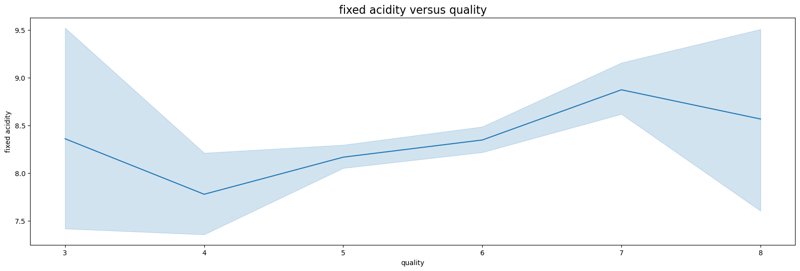
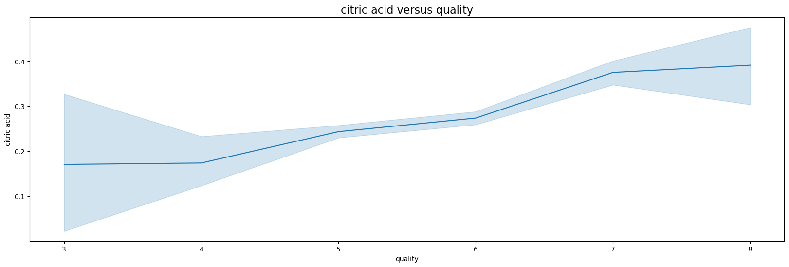
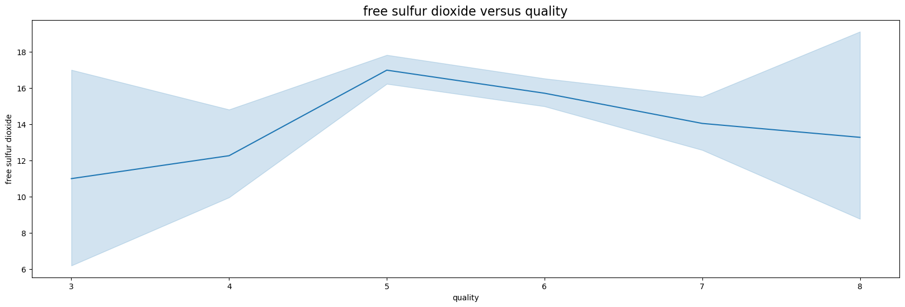
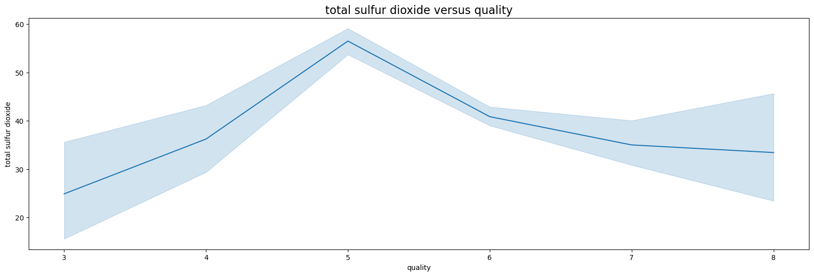
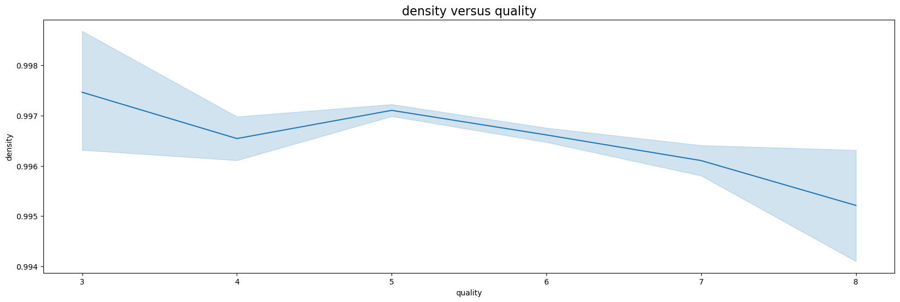
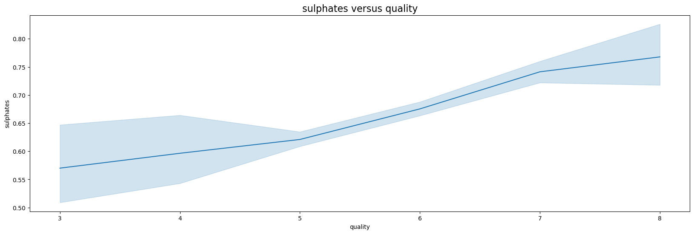
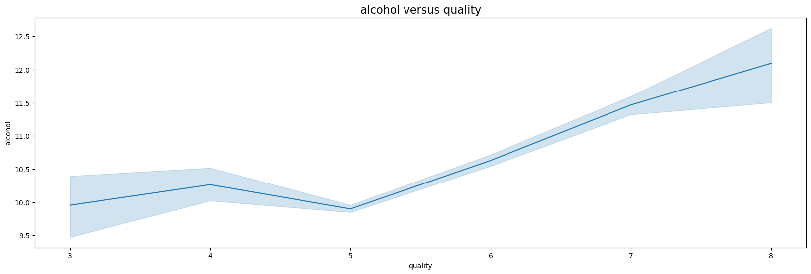
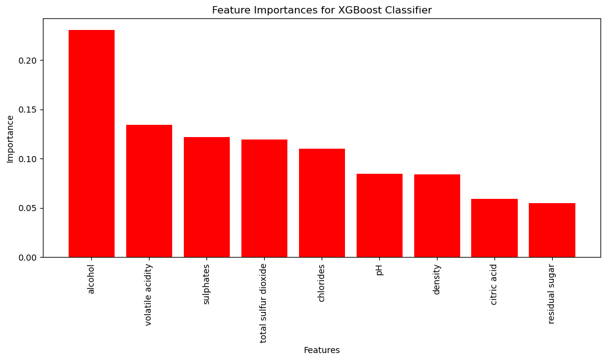

# Wine Quality Prediction

# Fine wine is like fine linen. <span style="color:blue"> It is difficult to replicate, but you know it when you have it.</span> 

An industrious winemaker has tasked me with the evaluation of wine quality to make it more appealing to discerning palates. The evaluation is to be  based on several measurable characteristics of the wine. The wine drinker then assigns a score to evaluate the quality of the wine. Scores can range from 0 to 8.


This was a particularly fun dataset to examine because the target variable is highly subjective whereas it is coupled with several objective measures in the wine making process. (How acidic do you like your wine?) Moreover, the evaluation of a wine's quality is highly variable even for exceptionally expensive wines. I like a challenge. 


Table of Contents

1. [The Problem](#Problem-Statement)
2. [What I Expected Versus What I Got](#What-I-Expected-Versus-What-I-Got)
3. [Getting Started with the Data](#Getting-Started-with-the-Data)
4. [Exploring the Data](#Exploring-the-Data)
5. [Pre-processing the Data](#Pre-processing-the-Data)
6. [The Models](#The-Models)
7. [Final Thoughts](#Final-Thoughts)

This project will look at a dataset with various characteristics of wine to determine if the wine is of good quality.

## Glossary of Terms

What we are given is:
- fixed acidity: the total concentration of non-volatile acids present in wine, such as tartaric acid, malic acid, and citric acid. It plays a role in the perceived sharpness and tartness of the wine. 
- volatile acidity: represents the concentration of volatile acids, primarily acetic acid, in wine. Higher levels of volatile acidity can contribute to unpleasant vinegar-like aromas and flavors.     
- citric acid: naturally occurring acid found in grapes and can also be added during winemaking. It provides freshness and can enhance the citrusy notes in wine.         
- residual sugar: the amount of sugar that remains unfermented in the wine after fermentation. It can influence the wine's perceived sweetness and can be an intentional stylistic choice or a result of incomplete fermentation.       
- chlorides: represents the concentration of salts, primarily sodium chloride, in wine. Higher levels of chlorides can impact the taste and mouthfeel of the wine.         
- free sulfur dioxide: form of sulfur dioxide (SO2) that exists in a free, unbound state in wine. It acts as an antioxidant and antimicrobial agent, helping to preserve the wine and prevent spoilage.
- total sulfur dioxide: the combined concentration of both free and bound forms of sulfur dioxide in wine. It is measured as an indicator of the wine's stability and preservation capacity.
- density: the mass of the wine per unit volume. Density measurements can provide information about the sugar and alcohol content of the wine.           
- pH:   measure of the acidity or alkalinity of the wine on a logarithmic scale. pH affects the wine's stability, microbial growth, and sensory attributes.  
- sulphates: chemical compounds containing sulfur dioxide (SO2) that are added to wine as preservatives. Sulphates help prevent oxidation and microbial spoilage.         
- alcohol:  the ethanol content in wine, which is produced during fermentation. Alcohol contributes to the wine's body, mouthfeel, and can influence its perceived warmth and intensity.          
- quality: refers to the overall excellence and desirability of the wine. Wine quality is subjective and is assessed based on sensory characteristics, such as aroma, flavor, balance, complexity, and structure.


# Problem Statement 
How can you influence your consumer to love your wine before it hits the bottle? This is our task. Find the factors in the winemaking process that have the biggest impact on your consumer's evaluation of your wine. 

Think about it. You really want to know how good a wine is before it hits the market. Some wines have the advantage of name recognition, but most wines are left with the hope of dusting the palate with something memorable so that you forget the price tag. This "gotta have it" evaluation is what a good wine maker wants to replicate. You want a wine that calls to you. Frankly, I want that wine too! (Promontory? Bond, anyone?) It sure would be good to know this before letting the wine rest in a barrel for a few years!

The second issue that there are a lot refinements made to wine to make it palatable. Besides how long it sits in a tank, how much citric acid to add, for instance, changes the acidity of the wine and how ``fresh" it appears to the consumer. There are so many factors that can impact the wine making process so we really want to whittle it down to the most important elements. Boom! Although the prospect of tasting wine with a clipboard in hand sounds fun, it might make for some befuddled, drunken evaluations. Instead, we will use machine learning to help us along. Quality control should be enjoyed at the end!


My goal is to determine the most important features and find a machine learning algorithm that can most closely predict the subjective quality rating of the wine consumer.

# What I Expected Versus What I Got
I tried several shallow algorithms and one basic neural network in this project.  
<ol>
  <li> Naive Bayes Classifier <br>
I really hoped that this classifier would surprise me. It is used so frequently in the wild for classification problems, and despite the fact that the assumptions governing its use are often not met, it tends to perform relatively well in practice. I knew that the data exhibited some strong correlation and that the features were definitely not independent, but I couldn't help myself but explore the model--maybe it would surprise me. Well, it didn't. In fact, it performed the most poorly of all the models.
</li>
<li> Decision Tree Classifier <br>
I knew that this classifier should be able to handle any nonlinear relationships in the data. Also, I was a little concerned about overfitting, but I gave it whirl. It was mediocre at 66% accuracy. I was disappointed, but having more classifiers in my pocket, I forged on.
</li>
<li> KNN Classifier<br>
So this was one that disappointed me. I used KNN with the default 5 neighbors. I really hoped it would uncover some great pattern in the data, but it actually performed worse than the Naive Bayes algorithm.
</li>
<li> Logistic Regression Classifier<br>
I was not too convinced about the linearly separable assumption in the data to be honest. I figured this would probably be a mess, but it turned to be one of the more reliable classifiers. On the one hand, there were not any glaring signs of outliers in the data. Each feature varied pretty smoothly with the quality rating. I admit I was surprised. 
</li>
<li> Ridge Classifier<br>
I expected the Ridge Classifier to model quality relatively well, and it did. It tends to handle collinearity well, and I had improved the datset by culling  the highly correlated features and removing them. I used the default tuning of the regularizaion to control overfitting. With another pass at modeling the data, I would probably change alpha to see if the model would improve. 
</li>
<li> Random Forest Classifier<br>
Random Forest is just the bomb always as shallow algorithms go. Since the dataset was not that big, computation time was not really an issue. It was the best model for the quality of the wine at approximately 75% correct evaluation. I liked using Random Forest as it was unlikely to overfit even using the default number of trees. I looked at feature importance to really hone in on what the model showed to be the most important in determining the quality of the wine. Spoiler alert! The alcohol content is king! More on that later though.
</li>
<li> XGBoost Classifier<br>
Just as with the Random Forest Classifier I expected it to perform well, and it did. In fact, it was a close second. I also looked at the feature importances for this model. The results were largely similar, although this model placed the alcohol importance at nearly twice as important as the next feature. This was not the case with the Random Forest Model. 
</li>
<li> Neural Network Classifier<br>
Now this was the only deep learning model that I used in this exploration. More than anything, I wanted to see if it would outperform the shallow algorithms--which it really did not. Since this is such a small dataset, I was also worried about it possibly overfitting the data. In the end, this model was the fifth most accurate out of nine. There does not seem to be any reason to use a deep learning model from what I can tell. 
</li>
<li> SVM<br>
Finally, I tried support vector machines. I worry about computation time to be honest as it seems to be the pokiest of the shallow algoritms. With the dataset it was not an issue, but it performed worse than three other shallow algorithms. I suspect that some tuning of parameters would have likely improved its accuracy. 
</li>
<br>
<br>
It turns out that as explorations go, I expected the models to mostly perform badly without some fine tuning, but I also expected the neural network to perform on the high end. At a highest accuracy of 75%, I would say that the fitting is mediocre, but again that subjectivity plays into the modeling. My guess is that there is a lot of noise in the data that is not being modeled.


# Getting Started with the Data

## First, I imported some anticipated dependencies.
### I started with Naive Bayes and the standard scaler since the data were not on a single scale. 
### I'll add dependencies as I run each model. 


```python
import pandas as pd
import matplotlib.pyplot as plt
import numpy as np
import seaborn as sns
from sklearn.model_selection import train_test_split
from sklearn.naive_bayes import GaussianNB
from sklearn.metrics import accuracy_score
from sklearn.preprocessing import StandardScaler
```

### I read in the csv file which was downloaded. It was originally downloaded from Kaggle. 

```python
df = pd.read_csv("winequality-red.csv")
```
### The data were about as clean as can get so we're set to start playing with the numbers and looking for trends.


# Exploring the Data


### I looked at the head and the tail of the data. The data are comprised of 10 features and the target is variable the wine quality. 

```python
df.head()
```


```python
df.tail()
```


<div>
<table border="1" class="dataframe">
  <thead>
    <tr style="text-align: right;">
      <th></th>
      <th>fixed acidity</th>
      <th>volatile acidity</th>
      <th>citric acid</th>
      <th>residual sugar</th>
      <th>chlorides</th>
      <th>free sulfur dioxide</th>
      <th>total sulfur dioxide</th>
      <th>density</th>
      <th>pH</th>
      <th>sulphates</th>
      <th>alcohol</th>
      <th>quality</th>
    </tr>
  </thead>
  <tbody>
    <tr>
      <th>1594</th>
      <td>6.2</td>
      <td>0.600</td>
      <td>0.08</td>
      <td>2.0</td>
      <td>0.090</td>
      <td>32.0</td>
      <td>44.0</td>
      <td>0.99490</td>
      <td>3.45</td>
      <td>0.58</td>
      <td>10.5</td>
      <td>5</td>
    </tr>
    <tr>
      <th>1595</th>
      <td>5.9</td>
      <td>0.550</td>
      <td>0.10</td>
      <td>2.2</td>
      <td>0.062</td>
      <td>39.0</td>
      <td>51.0</td>
      <td>0.99512</td>
      <td>3.52</td>
      <td>0.76</td>
      <td>11.2</td>
      <td>6</td>
    </tr>
    <tr>
      <th>1596</th>
      <td>6.3</td>
      <td>0.510</td>
      <td>0.13</td>
      <td>2.3</td>
      <td>0.076</td>
      <td>29.0</td>
      <td>40.0</td>
      <td>0.99574</td>
      <td>3.42</td>
      <td>0.75</td>
      <td>11.0</td>
      <td>6</td>
    </tr>
    <tr>
      <th>1597</th>
      <td>5.9</td>
      <td>0.645</td>
      <td>0.12</td>
      <td>2.0</td>
      <td>0.075</td>
      <td>32.0</td>
      <td>44.0</td>
      <td>0.99547</td>
      <td>3.57</td>
      <td>0.71</td>
      <td>10.2</td>
      <td>5</td>
    </tr>
    <tr>
      <th>1598</th>
      <td>6.0</td>
      <td>0.310</td>
      <td>0.47</td>
      <td>3.6</td>
      <td>0.067</td>
      <td>18.0</td>
      <td>42.0</td>
      <td>0.99549</td>
      <td>3.39</td>
      <td>0.66</td>
      <td>11.0</td>
      <td>6</td>
    </tr>
  </tbody>
</table>
</div>


### A quick look at the data showed that
- there were no missing values
- all of the features were coded as float
- the target variable, quality, was coded as integer so it will need to be converted to a categorical variable to indicate high or low quality when the data are pre-processed


```python
df.info()
```

    <class 'pandas.core.frame.DataFrame'>
    RangeIndex: 1599 entries, 0 to 1598
    Data columns (total 12 columns):
     #   Column                Non-Null Count  Dtype  
    ---  ------                --------------  -----  
     0   fixed acidity         1599 non-null   float64
     1   volatile acidity      1599 non-null   float64
     2   citric acid           1599 non-null   float64
     3   residual sugar        1599 non-null   float64
     4   chlorides             1599 non-null   float64
     5   free sulfur dioxide   1599 non-null   float64
     6   total sulfur dioxide  1599 non-null   float64
     7   density               1599 non-null   float64
     8   pH                    1599 non-null   float64
     9   sulphates             1599 non-null   float64
     10  alcohol               1599 non-null   float64
     11  quality               1599 non-null   int64  
    dtypes: float64(11), int64(1)
    memory usage: 150.0 KB


```python
np.shape(df)
```

    (1599, 12)


## I took a quick look at the descriptive statistics for the data to get a feel for the means and the spread of the data. 
These data are on very different scales.

```python
df.describe()
```


<div>

<table border="1" class="dataframe">
  <thead>
    <tr style="text-align: right;">
      <th></th>
      <th>fixed acidity</th>
      <th>volatile acidity</th>
      <th>citric acid</th>
      <th>residual sugar</th>
      <th>chlorides</th>
      <th>free sulfur dioxide</th>
      <th>total sulfur dioxide</th>
      <th>density</th>
      <th>pH</th>
      <th>sulphates</th>
      <th>alcohol</th>
      <th>quality</th>
    </tr>
  </thead>
  <tbody>
    <tr>
      <th>count</th>
      <td>1599.000000</td>
      <td>1599.000000</td>
      <td>1599.000000</td>
      <td>1599.000000</td>
      <td>1599.000000</td>
      <td>1599.000000</td>
      <td>1599.000000</td>
      <td>1599.000000</td>
      <td>1599.000000</td>
      <td>1599.000000</td>
      <td>1599.000000</td>
      <td>1599.000000</td>
    </tr>
    <tr>
      <th>mean</th>
      <td>8.319637</td>
      <td>0.527821</td>
      <td>0.270976</td>
      <td>2.538806</td>
      <td>0.087467</td>
      <td>15.874922</td>
      <td>46.467792</td>
      <td>0.996747</td>
      <td>3.311113</td>
      <td>0.658149</td>
      <td>10.422983</td>
      <td>5.636023</td>
    </tr>
    <tr>
      <th>std</th>
      <td>1.741096</td>
      <td>0.179060</td>
      <td>0.194801</td>
      <td>1.409928</td>
      <td>0.047065</td>
      <td>10.460157</td>
      <td>32.895324</td>
      <td>0.001887</td>
      <td>0.154386</td>
      <td>0.169507</td>
      <td>1.065668</td>
      <td>0.807569</td>
    </tr>
    <tr>
      <th>min</th>
      <td>4.600000</td>
      <td>0.120000</td>
      <td>0.000000</td>
      <td>0.900000</td>
      <td>0.012000</td>
      <td>1.000000</td>
      <td>6.000000</td>
      <td>0.990070</td>
      <td>2.740000</td>
      <td>0.330000</td>
      <td>8.400000</td>
      <td>3.000000</td>
    </tr>
    <tr>
      <th>25%</th>
      <td>7.100000</td>
      <td>0.390000</td>
      <td>0.090000</td>
      <td>1.900000</td>
      <td>0.070000</td>
      <td>7.000000</td>
      <td>22.000000</td>
      <td>0.995600</td>
      <td>3.210000</td>
      <td>0.550000</td>
      <td>9.500000</td>
      <td>5.000000</td>
    </tr>
    <tr>
      <th>50%</th>
      <td>7.900000</td>
      <td>0.520000</td>
      <td>0.260000</td>
      <td>2.200000</td>
      <td>0.079000</td>
      <td>14.000000</td>
      <td>38.000000</td>
      <td>0.996750</td>
      <td>3.310000</td>
      <td>0.620000</td>
      <td>10.200000</td>
      <td>6.000000</td>
    </tr>
    <tr>
      <th>75%</th>
      <td>9.200000</td>
      <td>0.640000</td>
      <td>0.420000</td>
      <td>2.600000</td>
      <td>0.090000</td>
      <td>21.000000</td>
      <td>62.000000</td>
      <td>0.997835</td>
      <td>3.400000</td>
      <td>0.730000</td>
      <td>11.100000</td>
      <td>6.000000</td>
    </tr>
    <tr>
      <th>max</th>
      <td>15.900000</td>
      <td>1.580000</td>
      <td>1.000000</td>
      <td>15.500000</td>
      <td>0.611000</td>
      <td>72.000000</td>
      <td>289.000000</td>
      <td>1.003690</td>
      <td>4.010000</td>
      <td>2.000000</td>
      <td>14.900000</td>
      <td>8.000000</td>
    </tr>
  </tbody>
</table>
</div>


## Check for missing data


```python
df.isnull().sum()
```


    fixed acidity           0
    volatile acidity        0
    citric acid             0
    residual sugar          0
    chlorides               0
    free sulfur dioxide     0
    total sulfur dioxide    0
    density                 0
    pH                      0
    sulphates               0
    alcohol                 0
    quality                 0
    dtype: int64


### I decided to look at the features alongside the quality rating to see if there were any obvious relationships. 
So I ran a loop to generate 10 plots comparing each feature with quality. 
It was clear that several variables tended to be inverse proportional to the quality whereas some had a direct relationship. If any of the other features shared some obviosu relatipship with the quality it was certainly not transparent to me at this point.

```python
# look at some line plots with the quality rating
# write a loop to generate the 10 plots
cols = (len(df.columns))-1
for col in range(0,cols) :
    
    plt.figure(figsize = (20,6))
    sns.lineplot(x='quality', y=df.columns[col], data = df)
    plt.title(f"{df.columns[col]} versus quality", fontsize = 16)
    plt.show()
```


    

    


    

    


    

    


    

    


    

    


    

    


    

    


    

    


    

    


    

    


    

    


```python
# look for correlations in the data
correlations = df.corr(method='pearson')
plt.figure(figsize=(16,12))
sns.heatmap(correlations, cmap="coolwarm", annot=True)
plt.show()
```


    

    


```python
# Iterate through the correlation matrix and print out columns having correlation above .6
print("The following column pairs have a correlation above 0.6:\n")
for col1 in correlations.columns:
    for col2 in correlations.columns:
        if col1 != col2 and correlations.loc[col1, col2] > 0.6:
            print(f"     {col1} and {col2}: {correlations.loc[col1, col2]}\n")
```

    The following column pairs have a correlation above 0.6:
    
         fixed acidity and citric acid: 0.6717034347641065
    
         fixed acidity and density: 0.6680472921189531
    
         citric acid and fixed acidity: 0.6717034347641065
    
         free sulfur dioxide and total sulfur dioxide: 0.6676664504810229
    
         total sulfur dioxide and free sulfur dioxide: 0.6676664504810229
    
         density and fixed acidity: 0.6680472921189531
    


- During the pre-processing phase we will drop the columns for fixed acidity, and free sulfur dioxide due to the high correlation with other features


```python
# Create a clean copy of the data
df_clean = df.copy()
```

# Pre-processing the Data
- Drop the columns for fixed acidity and free sulfur dioxide
- Rescale the data using StandardScaler


```python
# drop
df.drop(["fixed acidity", "free sulfur dioxide"], axis=1, inplace=True)
```


```python
df.head()
```


<div>

<table border="1" class="dataframe">
  <thead>
    <tr style="text-align: right;">
      <th></th>
      <th>volatile acidity</th>
      <th>citric acid</th>
      <th>residual sugar</th>
      <th>chlorides</th>
      <th>total sulfur dioxide</th>
      <th>density</th>
      <th>pH</th>
      <th>sulphates</th>
      <th>alcohol</th>
      <th>quality</th>
    </tr>
  </thead>
  <tbody>
    <tr>
      <th>0</th>
      <td>0.70</td>
      <td>0.00</td>
      <td>1.9</td>
      <td>0.076</td>
      <td>34.0</td>
      <td>0.9978</td>
      <td>3.51</td>
      <td>0.56</td>
      <td>9.4</td>
      <td>5</td>
    </tr>
    <tr>
      <th>1</th>
      <td>0.88</td>
      <td>0.00</td>
      <td>2.6</td>
      <td>0.098</td>
      <td>67.0</td>
      <td>0.9968</td>
      <td>3.20</td>
      <td>0.68</td>
      <td>9.8</td>
      <td>5</td>
    </tr>
    <tr>
      <th>2</th>
      <td>0.76</td>
      <td>0.04</td>
      <td>2.3</td>
      <td>0.092</td>
      <td>54.0</td>
      <td>0.9970</td>
      <td>3.26</td>
      <td>0.65</td>
      <td>9.8</td>
      <td>5</td>
    </tr>
    <tr>
      <th>3</th>
      <td>0.28</td>
      <td>0.56</td>
      <td>1.9</td>
      <td>0.075</td>
      <td>60.0</td>
      <td>0.9980</td>
      <td>3.16</td>
      <td>0.58</td>
      <td>9.8</td>
      <td>6</td>
    </tr>
    <tr>
      <th>4</th>
      <td>0.70</td>
      <td>0.00</td>
      <td>1.9</td>
      <td>0.076</td>
      <td>34.0</td>
      <td>0.9978</td>
      <td>3.51</td>
      <td>0.56</td>
      <td>9.4</td>
      <td>5</td>
    </tr>
  </tbody>
</table>
</div>


### Since quality is a numeric value, and we are trying to classify the wine as above average or not above average we need to designate a new column for above or below average. We will designate high_quality =1 for wines with a quality at or above 6 or a 0 if it is below the threshold. (Note that the designates high_quality to be in the 50th percentile or higher)


```python
# Create high_quality column based on the condition that it is a 1 if quality 
#scores is greater than 6 using a lambda function
df['high_quality'] = df['quality'].apply(lambda x: 0 if x < 6 else 1)
```


```python
df.head()
```


<div>

<table border="1" class="dataframe">
  <thead>
    <tr style="text-align: right;">
      <th></th>
      <th>volatile acidity</th>
      <th>citric acid</th>
      <th>residual sugar</th>
      <th>chlorides</th>
      <th>total sulfur dioxide</th>
      <th>density</th>
      <th>pH</th>
      <th>sulphates</th>
      <th>alcohol</th>
      <th>quality</th>
      <th>high_quality</th>
    </tr>
  </thead>
  <tbody>
    <tr>
      <th>0</th>
      <td>0.70</td>
      <td>0.00</td>
      <td>1.9</td>
      <td>0.076</td>
      <td>34.0</td>
      <td>0.9978</td>
      <td>3.51</td>
      <td>0.56</td>
      <td>9.4</td>
      <td>5</td>
      <td>0</td>
    </tr>
    <tr>
      <th>1</th>
      <td>0.88</td>
      <td>0.00</td>
      <td>2.6</td>
      <td>0.098</td>
      <td>67.0</td>
      <td>0.9968</td>
      <td>3.20</td>
      <td>0.68</td>
      <td>9.8</td>
      <td>5</td>
      <td>0</td>
    </tr>
    <tr>
      <th>2</th>
      <td>0.76</td>
      <td>0.04</td>
      <td>2.3</td>
      <td>0.092</td>
      <td>54.0</td>
      <td>0.9970</td>
      <td>3.26</td>
      <td>0.65</td>
      <td>9.8</td>
      <td>5</td>
      <td>0</td>
    </tr>
    <tr>
      <th>3</th>
      <td>0.28</td>
      <td>0.56</td>
      <td>1.9</td>
      <td>0.075</td>
      <td>60.0</td>
      <td>0.9980</td>
      <td>3.16</td>
      <td>0.58</td>
      <td>9.8</td>
      <td>6</td>
      <td>1</td>
    </tr>
    <tr>
      <th>4</th>
      <td>0.70</td>
      <td>0.00</td>
      <td>1.9</td>
      <td>0.076</td>
      <td>34.0</td>
      <td>0.9978</td>
      <td>3.51</td>
      <td>0.56</td>
      <td>9.4</td>
      <td>5</td>
      <td>0</td>
    </tr>
  </tbody>
</table>
</div>


```python
## Drop the quality column as it is now encoded in high_quality
df.drop(["quality"],axis = 1, inplace=True)
```

### Set up the feature and target arrays


```python

```


```python
X = df.iloc[:, :-1]
X.head()
```


<div>
<style scoped>
    .dataframe tbody tr th:only-of-type {
        vertical-align: middle;
    }

    .dataframe tbody tr th {
        vertical-align: top;
    }

    .dataframe thead th {
        text-align: right;
    }
</style>
<table border="1" class="dataframe">
  <thead>
    <tr style="text-align: right;">
      <th></th>
      <th>volatile acidity</th>
      <th>citric acid</th>
      <th>residual sugar</th>
      <th>chlorides</th>
      <th>total sulfur dioxide</th>
      <th>density</th>
      <th>pH</th>
      <th>sulphates</th>
      <th>alcohol</th>
    </tr>
  </thead>
  <tbody>
    <tr>
      <th>0</th>
      <td>0.70</td>
      <td>0.00</td>
      <td>1.9</td>
      <td>0.076</td>
      <td>34.0</td>
      <td>0.9978</td>
      <td>3.51</td>
      <td>0.56</td>
      <td>9.4</td>
    </tr>
    <tr>
      <th>1</th>
      <td>0.88</td>
      <td>0.00</td>
      <td>2.6</td>
      <td>0.098</td>
      <td>67.0</td>
      <td>0.9968</td>
      <td>3.20</td>
      <td>0.68</td>
      <td>9.8</td>
    </tr>
    <tr>
      <th>2</th>
      <td>0.76</td>
      <td>0.04</td>
      <td>2.3</td>
      <td>0.092</td>
      <td>54.0</td>
      <td>0.9970</td>
      <td>3.26</td>
      <td>0.65</td>
      <td>9.8</td>
    </tr>
    <tr>
      <th>3</th>
      <td>0.28</td>
      <td>0.56</td>
      <td>1.9</td>
      <td>0.075</td>
      <td>60.0</td>
      <td>0.9980</td>
      <td>3.16</td>
      <td>0.58</td>
      <td>9.8</td>
    </tr>
    <tr>
      <th>4</th>
      <td>0.70</td>
      <td>0.00</td>
      <td>1.9</td>
      <td>0.076</td>
      <td>34.0</td>
      <td>0.9978</td>
      <td>3.51</td>
      <td>0.56</td>
      <td>9.4</td>
    </tr>
  </tbody>
</table>
</div>


```python
y = df.iloc[:,-1]
y.head()
```


    0    0
    1    0
    2    0
    3    1
    4    0
    Name: high_quality, dtype: int64


## Set up the training and test data


```python
X_test, X_train, y_test, y_train = train_test_split(X, y, random_state =4, test_size =.2)
```


```python

```


```python

```

### Rescale the data using StandardScaler


```python
scaler = StandardScaler().fit(X_train)
```


```python
X_train_scaled = scaler.transform(X_train)
```

# The Models

## Run the Naive Bayes algorithm 


```python
model = GaussianNB()
```


```python
# Fit the Naive Bayes model to the training data
model.fit(X_train, y_train)
```


```python
y_pred = model.predict(X_test)
```


```python
# Calculate the accuracy score
accuracy = accuracy_score(y_test, y_pred)
print("Naive Bayes Model Accuracy:", accuracy)
```

    Naive Bayes Model Accuracy: 0.4573885848318999


## Decision Tree Classification


```python
from sklearn.tree import DecisionTreeClassifier
```


```python
# create instance of Decision Tree Classifier
dt = DecisionTreeClassifier()
```


```python
# fit the training data
dt.fit(X_train, y_train)
```


```python
# run the predictions
y_pred_dt = dt.predict(X_test)
```


```python
accuracy_dt = accuracy_score(y_test, y_pred_dt)
print("Naive Bayes Model Accuracy:", accuracy)
print("Decision Tree Classifier Accuracy Score: ", accuracy_dt)
```

    Naive Bayes Model Accuracy: 0.4573885848318999
    Decision Tree Classifier Accuracy Score:  0.6645817044566067


## KNN Classification


```python
from sklearn.neighbors import KNeighborsClassifier
```


```python
knn = KNeighborsClassifier()
```


```python
knn.fit(X_train, y_train)
```


```python
y_pred_knn = knn.predict(X_test)
```


```python
accuracy_knn = accuracy_score(y_test, y_pred_knn)
print("Naive Bayes Model Accuracy:", accuracy)
print("Decision Tree Classifier Accuracy Score: ", accuracy_dt)
print("KNN Classifier Accuracy Score", accuracy_knn)
```

    Naive Bayes Model Accuracy: 0.4573885848318999
    Decision Tree Classifier Accuracy Score:  0.6645817044566067
    KNN Classifier Accuracy Score 0.6528537920250196


## Logistic Regression Classification


```python
from sklearn.linear_model import LogisticRegression
```


```python
lg = LogisticRegression(max_iter=1000)
```


```python
lg.fit(X_train, y_train)
```


```python
y_pred_lg = lg.predict(X_test)
```


```python
accuracy_lg = accuracy_score(y_test, y_pred_lg)
print("Naive Bayes Model Accuracy:", accuracy)
print("Decision Tree Classifier Accuracy Score: ", accuracy_dt)
print("KNN Classifier Accuracy Score: ", accuracy_knn)
print("Logistic Regression Accuracy Score: ", accuracy_lg)
```

    Naive Bayes Model Accuracy: 0.4573885848318999
    Decision Tree Classifier Accuracy Score:  0.6645817044566067
    KNN Classifier Accuracy Score:  0.6528537920250196
    Logistic Regression Accuracy Score:  0.7341673182173573


## Ridge Classification


```python
from sklearn.linear_model import RidgeClassifier
```


```python
ridge = RidgeClassifier()
```


```python
ridge.fit(X_train, y_train)
y_pred_ridge = ridge.predict(X_test)
```


```python
accuracy_ridge = accuracy_score(y_test, y_pred_ridge)
print("Naive Bayes Model Accuracy:", accuracy)
print("Decision Tree Classifier Accuracy Score: ", accuracy_dt)
print("KNN Classifier Accuracy Score: ", accuracy_knn)
print("Logistic Regression Accuracy Score: ", accuracy_lg)
print("Ridge Classifier Accuracy Score: ", accuracy_ridge)
```

    Naive Bayes Model Accuracy: 0.4573885848318999
    Decision Tree Classifier Accuracy Score:  0.6645817044566067
    KNN Classifier Accuracy Score:  0.6528537920250196
    Logistic Regression Accuracy Score:  0.7341673182173573
    Ridge Classifier Accuracy Score:  0.727130570758405


## Random Forest


```python
from sklearn.ensemble import RandomForestClassifier
```


```python
rf = RandomForestClassifier()
```


```python
rf.fit(X_train, y_train)
y_pred_rf = rf.predict(X_test)
```


```python
accuracy_rf = accuracy_score(y_test, y_pred_rf)
print("Naive Bayes Model Accuracy:", accuracy)
print("Decision Tree Classifier Accuracy Score: ", accuracy_dt)
print("KNN Classifier Accuracy Score: ", accuracy_knn)
print("Logistic Regression Accuracy Score: ", accuracy_lg)
print("Ridge Classifier Accuracy Score: ", accuracy_ridge)
print("Random Forest Accuracy Score: ", accuracy_rf)
```

    Naive Bayes Model Accuracy: 0.4573885848318999
    Decision Tree Classifier Accuracy Score:  0.6645817044566067
    KNN Classifier Accuracy Score:  0.6528537920250196
    Logistic Regression Accuracy Score:  0.7341673182173573
    Ridge Classifier Accuracy Score:  0.727130570758405
    Random Forest Accuracy Score:  0.7505863956215794


```python
importances = rf.feature_importances_

# Print the feature importances
for feature, importance in zip(X_train.columns, importances):
    print(f"{feature}: {importance}")
```

    volatile acidity: 0.1621988083697836
    citric acid: 0.06953486385873693
    residual sugar: 0.055230878066261535
    chlorides: 0.10691575550204956
    total sulfur dioxide: 0.13556143648974062
    density: 0.10360789078509489
    pH: 0.07867991921216391
    sulphates: 0.1193080282822712
    alcohol: 0.16896241943389773


```python
# Sort the feature importances in descending order
sorted_indices = np.argsort(importances)[::-1]
sorted_importances = importances[sorted_indices]
sorted_features = X_train.columns[sorted_indices]
```


```python
# Create a bar plot of feature importances
plt.figure(figsize=(10, 6))
plt.bar(range(len(sorted_importances)), sorted_importances)
plt.xticks(range(len(sorted_importances)), sorted_features, rotation='vertical')
plt.xlabel('Features')
plt.ylabel('Importance')
plt.title('Feature Importances for Random Forest Classifier')
plt.tight_layout()
plt.show()
```


    

    


## XGBoost Classifier


```python
from xgboost import XGBClassifier
```


```python
xgb = XGBClassifier()
```


```python
xgb.fit(X_train, y_train)
y_pred_xgb = xgb.predict(X_test)
```


```python
accuracy_xgb = accuracy_score(y_test, y_pred_xgb)
print("Naive Bayes Model Accuracy:", accuracy)
print("Decision Tree Classifier Accuracy Score: ", accuracy_dt)
print("KNN Classifier Accuracy Score: ", accuracy_knn)
print("Logistic Regression Accuracy Score: ", accuracy_lg)
print("Ridge Classifier Accuracy Score: ", accuracy_ridge)
print("Random Forest Accuracy Score: ", accuracy_rf)
print("XGBoost Classifier Accuracy Score: ", accuracy_xgb)
```

    Naive Bayes Model Accuracy: 0.4573885848318999
    Decision Tree Classifier Accuracy Score:  0.6645817044566067
    KNN Classifier Accuracy Score:  0.6528537920250196
    Logistic Regression Accuracy Score:  0.7341673182173573
    Ridge Classifier Accuracy Score:  0.727130570758405
    Random Forest Accuracy Score:  0.7505863956215794
    XGBoost Classifier Accuracy Score:  0.745113369820172


```python
# Access the feature importances
importances_xgb = xgb.feature_importances_
```


```python
# Print the feature importances
for feature, importance in zip(X_train.columns, importances_xgb):
    print(f"{feature}: {importance}")
```

    volatile acidity: 0.13444578647613525
    citric acid: 0.0590837188065052
    residual sugar: 0.05514124780893326
    chlorides: 0.11008543521165848
    total sulfur dioxide: 0.11959460377693176
    density: 0.08419746160507202
    pH: 0.08494173735380173
    sulphates: 0.12188128381967545
    alcohol: 0.23062869906425476


```python
# Sort the feature importances in descending order
sorted_indices = np.argsort(importances_xgb)[::-1]
sorted_importances = importances_xgb[sorted_indices]
sorted_features = X_train.columns[sorted_indices]
```


```python
# Create a bar plot of feature importances
plt.figure(figsize=(10, 6))
plt.bar(range(len(sorted_importances)), sorted_importances, color='red')
plt.xticks(range(len(sorted_importances)), sorted_features, rotation='vertical')
plt.xlabel('Features')
plt.ylabel('Importance')
plt.title('Feature Importances for XGBoost Classifier')
plt.tight_layout()
plt.show()
```


    

    


## Basic Neural Network


```python
from sklearn.neural_network import MLPClassifier
```


```python
mlp = MLPClassifier(hidden_layer_sizes=(100, 50), max_iter = 1000, activation='relu', solver='adam', random_state = 12)
```


```python
mlp.fit(X_train, y_train)
y_pred_mlp = mlp.predict(X_test)
```


```python
accuracy_mlp = accuracy_score(y_test, y_pred_mlp)
print("Naive Bayes Model Accuracy:", accuracy)
print("Decision Tree Classifier Accuracy Score: ", accuracy_dt)
print("KNN Classifier Accuracy Score: ", accuracy_knn)
print("Logistic Regression Accuracy Score: ", accuracy_lg)
print("Ridge Classifier Accuracy Score: ", accuracy_ridge)
print("Random Forest Accuracy Score: ", accuracy_rf)
print("XGBoost Classifier Accuracy Score: ", accuracy_xgb)
print("Neural Network Classifier Accuracy Score: ", accuracy_mlp)
```

    Naive Bayes Model Accuracy: 0.4573885848318999
    Decision Tree Classifier Accuracy Score:  0.6645817044566067
    KNN Classifier Accuracy Score:  0.6528537920250196
    Logistic Regression Accuracy Score:  0.7341673182173573
    Ridge Classifier Accuracy Score:  0.727130570758405
    Random Forest Accuracy Score:  0.7505863956215794
    XGBoost Classifier Accuracy Score:  0.745113369820172
    Neural Network Classifier Accuracy Score:  0.7232212666145426


## SVM Classifier


```python
from sklearn.svm import SVC
```


```python
svc = SVC ()
```


```python
svc.fit(X_train, y_train)
y_pred_svc = svc.predict(X_test)
```


```python
accuracy_svc = accuracy_score(y_test, y_pred_svc)
print("Naive Bayes Model Accuracy:", accuracy)
print("Decision Tree Classifier Accuracy Score: ", accuracy_dt)
print("KNN Classifier Accuracy Score: ", accuracy_knn)
print("Logistic Regression Accuracy Score: ", accuracy_lg)
print("Ridge Classifier Accuracy Score: ", accuracy_ridge)
print("Random Forest Accuracy Score: ", accuracy_rf)
print("XGBoost Classifier Accuracy Score: ", accuracy_xgb)
print("Neural Network Classifier Accuracy Score: ", accuracy_mlp)
print("SVM Classifier Accuracy Score: ", accuracy_svc)
```

    Naive Bayes Model Accuracy: 0.4573885848318999
    Decision Tree Classifier Accuracy Score:  0.6645817044566067
    KNN Classifier Accuracy Score:  0.6528537920250196
    Logistic Regression Accuracy Score:  0.7341673182173573
    Ridge Classifier Accuracy Score:  0.727130570758405
    Random Forest Accuracy Score:  0.7505863956215794
    XGBoost Classifier Accuracy Score:  0.745113369820172
    Neural Network Classifier Accuracy Score:  0.7232212666145426
    SVM Classifier Accuracy Score:  0.6223612197028929


# Final Thoughts

So based on my exploration the model performances, I would recommend that my wine maker go with the Random Forest Algorithm in order to best evaluate the wine. Moreover, I am going to suggest based on the feature importance evaluations of both the Random Forest and XGBoost algorithms that the greatest importance be placed on
the following factors in order:
1. alcohol
2. volatile acidity
3. sulfates
4. total sulfuric acid
<br>
In both models, these four factors accounted for approximately 60% of the evaluation of quality. Alcohol content was the most important factor in determining the quality of the wine. (Do not spare the alcohol, friends!)  
<br>
Overall, these measured factors are also greatly dependent on the scale of the winemaking operations and the technique employed in making the wine itself. That being said, I believe that this gives a starting point for improving the overal impression of the wine on the consumer and to better inform the production process.
<br>
Some future explorations that would be interesting to consider: 
- exploring the types of winemaking (red versus white for instance) and the relationship between the perceived quality for the different types of wine
- comparing consumer purchasing data with quality evaluation to build a profile that helps predict wines that would match the consumer's palate 
- comparing how cost affects the perception of the quality of wine

<br> 
That's it for now. Thanks for reading!


